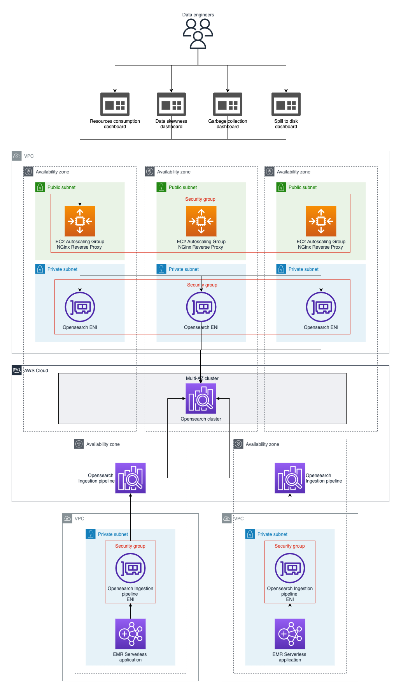

# AWS Spark Observability

Introducing AWS Spark Observability - An open source observability solution for Apache Spark

AWS Spark Observability provides real-time visibility into Spark application performance to detect and troubleshoot common challenges like task skew, GC pressure, shuffle read/write bottlenecks, speculative tasks, etc.

It consists of a jar file that is added to the classpath of Spark applications. This jar contains:
 * a custom SparkListener that collects metrics like task runtime, GC time, shuffle read/write metrics, etc. The metrics are aggregated and sent to a backend for storage and analysis.
 * a Log4J custom appender that ships application logs in real-time to the backend. This provides correlated log data to complement the metrics for troubleshooting.

The components of the solution (including the backend) are available as an AWS CDK application that can be easily deployed and adapted to your AWS Cloud configuration. 
It consists of components like an Opensearch cluster for logs and metrics storage, Opensearch Dashboard for visualization and Opensearch Ingestion Pipeline for collecting logs and metrics in different AWS VPC.
The solution provides out-of-the-box dashboards and alerts tuned for Spark troubleshooting.

We utilize Spark's extensibility APIs like SparkListener and asynchronous Log4J appenders to build an non-invasive monitoring solution that doesn't impact the performance of your Spark application.

## Architecture

## Getting started

Follow the instructions in the [infra](./infra/README.md) folder to deploy the different components of the solution via AWS CDK.

## Limitations

 * Cross ingestion is only available for [public ingestor](https://docs.aws.amazon.com/opensearch-service/latest/developerguide/configure-client.html#configure-client-auth). 
   It means the Spark application should be  public or can access public ingestor via a NAT gateway.

## License
This library is licensed under the MIT-0 License. See the [LICENSE](LICENSE) file.

## Feedback
We'd love to hear from you! Please create [GitHub issues](https://github.com/awslabs/aws-data-solutions-framework/issues) for additional features or solutions you'd like to see.

