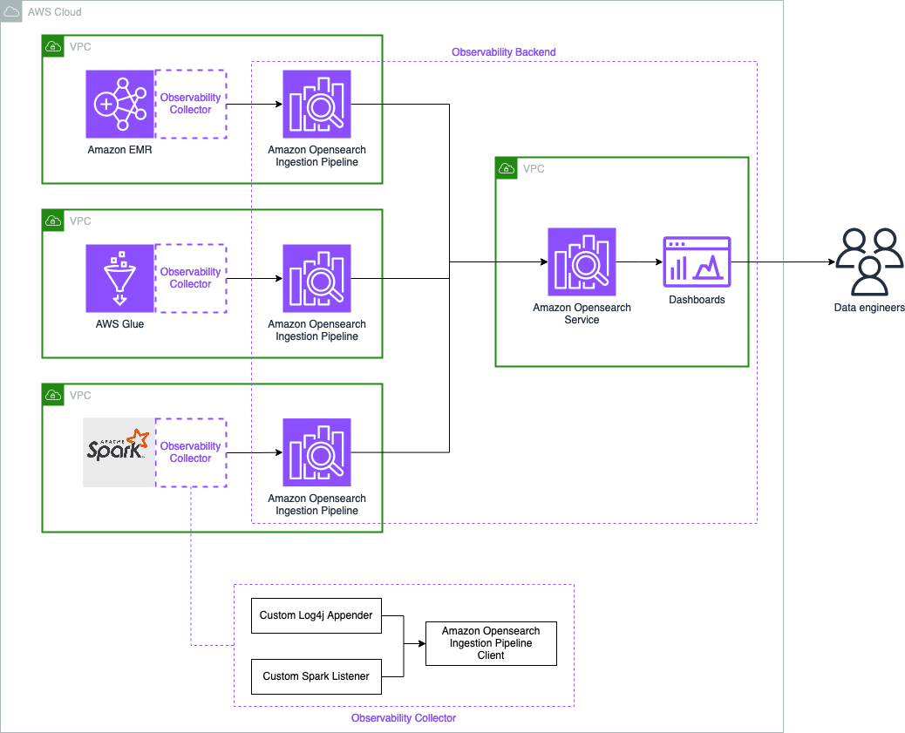

# AWS Spark Observability

Introducing AWS Spark Observability - An open source observability solution for Apache Spark

AWS Spark Observability provides real-time visibility into Spark application performance to detect and troubleshoot common challenges like task skew, GC pressure, shuffle read/write bottlenecks, speculative tasks, etc.

The solution is based on a collector component to be loaded into your Apache Spark application and a backend component based on Amazon Opensearch Service. It provides out-of-the-box dashboards and alerts tuned for Spark troubleshooting.

The collector component is a jar file that is added to the classpath of Spark applications. 
It's a Scala based component available as a jar file that is compatible with any Apache Spark 3.3.0 runtime as long as the Jar file is on the classpath. it contains:
 * a custom SparkListener that collects metrics like task runtime, GC time, shuffle read/write metrics, etc. The metrics are aggregated and sent to a backend for storage and analysis.
 * a Log4J custom appender that ships application logs in real-time to the backend. This provides correlated log data to complement the metrics for troubleshooting.
We utilize Spark's extensibility APIs including `SparkListener` and asynchronous Log4J appenders to build an non-invasive monitoring solution that doesn't impact the performance of your Spark application.

The backend components is an AWS CDK application that can be easily deployed and adapted to your AWS Cloud configuration:
 * The backend stack provides an Opensearch based backend infrastructure to centrally store and analyze the logs and metrics. 
   The backend is optional, you can use your own Opensearch domain.
 * The ingestor stack provides 2 Opensearch Ingestion pipelines to ingest logs and metrics from the Spark applications. 
   The ingestor is deployed next to your Spark applications (same subnet). You need one ingestor per subnet where you have Spark applications.
 * The EMR Serverless example stack provides an EMR Serverless application that runs the TPC-DS 3TB benchmark and send logs and metrics to the ingestor stack.
 * The VPC stack provides a simple VPC that can be used to deploy the ingestor stack and the EMR Serverless example.

## Documentation

Learn how to deploy the solution by following these [instructions](./GETTING-STARTED.md).

## Limitations

 * Cross ingestion is only available for [public ingestor](https://docs.aws.amazon.com/opensearch-service/latest/developerguide/configure-client.html#configure-client-auth). 
   It means the Spark application should be  public or can access public ingestor via a NAT gateway.

## License
This library is licensed under the MIT-0 License. See the [LICENSE](LICENSE) file.

## Feedback
We'd love to hear from you! Please create [GitHub issues](https://github.com/awslabs/aws-data-solutions-framework/issues) for additional features or solutions you'd like to see.

