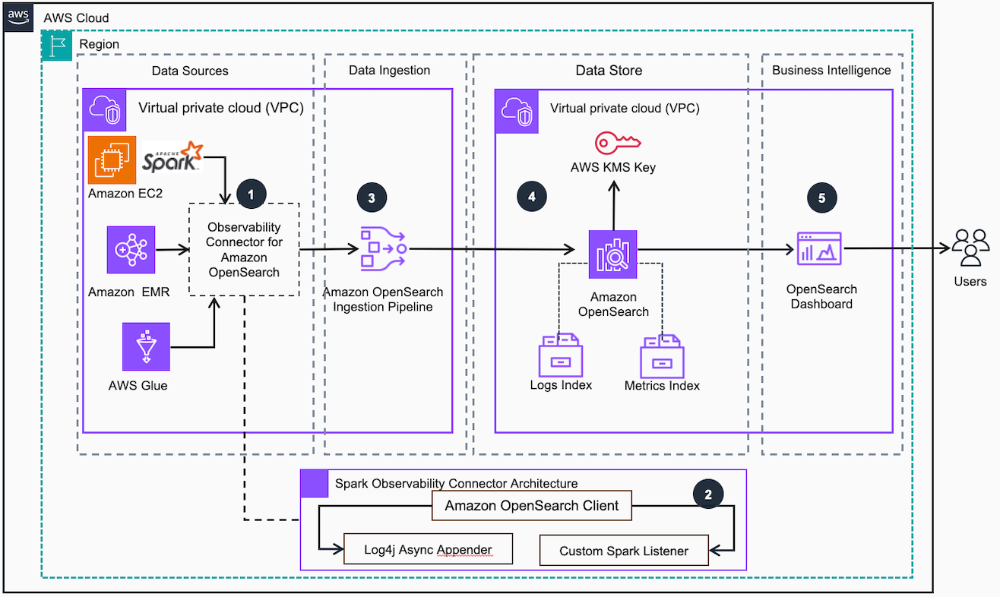

# Guidance for Spark Analytics Observability

## Table of Content
1. [Overview](#overview)
    - [Cost](#cost)
2. [Prerequisites](#prerequisites)
    - [Operating System](#operating-system)
3. [Deployment Steps](#deployment-steps)
4. [Deployment Validation](#deployment-validation)
5. [Running the Guidance](#running-the-guidance)
6. [Next Steps](#next-steps-required)
7. [Cleanup](#cleanup-required)

## Overview
Introducing AWS Spark Observability - an open source observability solution for [Apache Spark](https://spark.apache.org/)

AWS Spark Observability provides real-time visibility into Spark application performance to detect and troubleshoot common challenges like task skew, GC pressure, shuffle read/write bottlenecks, speculative tasks, etc.

The solution is based on a collector component to be loaded into your Apache Spark application and a backend component based on Amazon Opensearch Service. It provides out-of-the-box dashboards and alerts tuned for Spark troubleshooting.

The collector component is a jar file that is added to the classpath(s) of Spark applications. 
It's a Scala based component available as a jar file that is compatible with any Apache Spark 3.3.0 runtime as long as it is on the classpath. it contains:
 * a custom SparkListener that collects metrics like task runtime, GC time, shuffle read/write metrics, etc. The metrics are aggregated and sent to a backend for storage and analysis.
 * a Log4J custom appender that ships application logs in real-time to the backend. This provides correlated log data to complement the metrics for troubleshooting.
We utilize Spark's extensibility APIs including `SparkListener` and asynchronous Log4J appenders to build an non-invasive monitoring solution that doesn't impact the performance of your Spark application.

The backend components is an AWS CDK application that can be easily deployed and adapted to your AWS Cloud configuration:
 * The backend stack provides an Opensearch based backend infrastructure to centrally store and analyze the logs and metrics. 
   The backend is optional, you can use your own Opensearch domain.
 * The ingestor stack provides 2 Opensearch Ingestion pipelines to ingest logs and metrics from the Spark applications. 
   The ingestor is deployed next to your Spark applications (same subnet). You need one ingestor per subnet where you have Spark applications.
 * The EMR Serverless example stack provides an EMR Serverless application that runs the TPC-DS 3TB benchmark and send logs and metrics to the ingestor stack.
 * The VPC stack provides a simple VPC that can be used to deploy the ingestor stack and the EMR Serverless example.



Below is a description of the workflow implemented within this guidance:

1. The Observability connector for [Amazon OpenSearch Service (Observability Connector)](https://aws.amazon.com/opensearch-service/) is packaged into [Spark applications](https://www.databricks.com/glossary/what-are-spark-applications) running on [Amazon EMR](https://aws.amazon.com/emr/), [AWS Glue](https://aws.amazon.com/glue/) or self-hosted on [Amazon EC2] instance. The connector is a [Java ARchive( JAR)](https://docs.oracle.com/javase/8/docs/technotes/guides/jar/jarGuide.html) file to put on the driver and executor classpath.
2. The Observability Connector includes a custom log appender ([Log4j Async Appender](https://logging.apache.org/log4j/2.x/manual/appenders.html)) and Custom Spark Listener. They collect logs and metrics from the application and push the data out through the Amazon OpenSearch client
3. The Observability connector pushes data into an [Amazon OpenSearch Integration pipeline](https://docs.aws.amazon.com/opensearch-service/latest/developerguide/osis-features-overview.html). The pipeline applies data transformation and acts as an ingestion buffer into Amazon OpenSearch.
4. Ingestion related Logs and metrics are stored into Amazon OpenSearch indexes one for each data type. The data delivery frequency is defined as part of the OpenSearch pipeline configuration. Logs and metrics data are encrypted using an [AWS Key Management Service (KMS)](https://aws.amazon.com/kms/) Key
5. Pre-Built Amazon OpenSearch Dashboards offers authenticated users insights into their data pipelines via aggregated views of performance metrics and logs at various levels of granularity e.g. Spark Application, Job run, Stage, Partition. The dashboard also provides performance scores calculated based on the collected metrics to allow for easier analysis.


## Cost
_You are responsible for the cost of the AWS services used while running this Guidance. As of April 2024, the cost for running this Guidance with the default settings in the US East (Ohio) is approximately $929.26 per month for processing around 120 GB of logs and metrics per month. This equates to 2 TPCCDS becnhmark data ingestion jobs per business day, assuming 730 hours of OpenSearch cluster usage. Please note that our estimate does not include any assumptions in terms of dashboard usage. You are responsible for resizing the OpenSearch dashboard cluster according to your specific needs._

The reverse proxy running on EC2 is totally optional, and may be skipped during the deployment. You may deploy it only if you currently have no mechanism to securely expose the dashboards to clients located outside the VPC.

Suggest you keep this boilerplate text:
_We recommend creating a [Budget](https://docs.aws.amazon.com/cost-management/latest/userguide/budgets-managing-costs.html) through [AWS Cost Explorer](https://aws.amazon.com/aws-cost-management/aws-cost-explorer/) to help manage costs. Prices are subject to change. For full details, refer to the pricing webpage for each AWS service used in this Guidance._

### Sample Cost Table ( required )

The following table provides a sample cost breakdown for deploying this Guidance with the default parameters in the US East (N. Virginia) Region for one month.

| AWS service  | Dimensions | Cost [USD] |
| ----------- | ------------ | ------------ |
| Amazon OpenSearch | 730 hours per month  | $ 220.87 per month |
| Amazon OpenSearch Logs Pipeline | 3 OCUs  | $ 525.60 per month |
| Amazon OpenSearch Metrics Pipeline | 1 OCUs  | $ 175.20 per month |
| Amazon EC2 (Optional for reverse proxy) | 730 hours per month | $ 7.59 |
| **Total cost per month** | | **$ 929.26** |

## Prerequisites

### Operating System
No specific OS is required, unless you decide to use the reverse proxy in which case the OS use by default is **<Amazon Linux 2 AMI>**

### SBT
If you don't have SBT, install from [here](https://www.scala-sbt.org/download.html)

### Python
This project is based on [Python3](https://www.python.org/download/releases/3.0/). Please ensure it is installed beforehand
This project is set up like a standard Python project.  The initialization process also creates a virtualenv within this project, stored under the `.venv` directory.  To create the virtualenv it assumes that there is a `python3` (or `python` for Windows) executable in your path with access to the `venv` package. You can alternativeky manually create a virtualenv.


### AWS CDK bootstrap
This guidance uses AWS CDK for bootstrapping.
If you don't CDK, follow [these instructions](https://docs.aws.amazon.com/cdk/v2/guide/getting_started.html#getting_started_install)
Please follow the [Bootstrapping guide](https://docs.aws.amazon.com/cdk/v2/guide/bootstrapping.html) prior to deploying the guidance, in case your environment has not been bootstrapped yet.

## Deployment Steps
The solution guidance includes multiple layers some of which are optional. The recommended order of deployment is:
1. Clone the repo using command
   ```bash
   git clone https://github.com/aws-solutions-library-samples/guidance-for-analytics-observability-on-aws.git
   ```
3. Go into the `infra` folder
  ```bash
  cd infra
  ``` 
4. Create Python environment:
 ```bash 
    python3 -m venv .venv
 ```
5. Activate your virtualenv: 
  ```bash
     source .venv/bin/activate
  ```
 If you are deploying on a Windows platform, you would activate the virtualenv like this: 
  ```
   % .venv\Scripts\activate.bat
  ```
6. Install Python dependencies: 
  ```bash
     pip install -r requirements.txt
  ``` 
7. Deploy AWS CDK stacks that fit your use cases:
   1. The [Backend stack](#backend-stack) (OPTIONAL). Alternatively you can provide your own Amazon Opensearch Domain.
   2. Generic [VPC stack](#vpc-stack-optional) (OPTIONAL). Alternatively you can provide your own VPC. This is where deploy your Spark application.
   3. The [Ingestor stack](#ingestor-stack) (REQUIRED). It should be deployed in the same VPC and subnets as your Spark application.
   4. Deploy [EMR Serverless example stack](#emr-serverless-example-stack-optional) (OPTIONAL). Alternatively configure your Spark application with the collector that you built and run it.
   Select the stack to deploy using the `Stack` context parameter of CDK with the values `backend`, `vpc`, `ingestor` or `example`:
```bash
cdk deploy -c Stack=backend ...
cdk deploy -c Stack=vpc ...
cdk deploy -c Stack=ingestor ...
cdk deploy -c Stack=example ...
```

### Backend stack

The backend stack provides the following components:
 * A private Amazon Opensearch domain with Fine Grained Access Control enabled and internal database users
 * An Amazon VPC with 3 public and 3 private subnets, one per AZ, if no VPC is provided
 * An Amazon IAM Role with administrator privileges on the domain
 * An ingestion role with write permissions on logs and metrics indices in the Opensearch domain and used by the pipelines
 * User/password secrets in AWS Secret Manager for Opensearch Dashboards user and administrator
 * An Amazon KMS Key to encrypt the data in the Opensearch domain
 * An Amazon Cloudwatch Log Group to store logs from the Opensearch domain
 * A custom resource based on AWS Lambda to configure the Opensearch domain:
    * Configure the user and roles
    * Create the index mappings
    * Create the index templates  
    * Load the pre-defined dashboards

#### CDK context Parameters
 * `TshirtSize`: [REQUIRED] define the size of the Opensearch domain to deploy. Possible options are XS, S, M, L, XL.
 * `VpcID`: [OPTIONAL] the VPC ID where you want to deploy the backend infrastructure. 
   If not provided, the stack will create a VPC in 3 AZs with one public and one private subnet per AZ.
 * `OpensearchSubnetsIDs`: [OPTIONAL] the comma separated list of subnet IDs to use for deploying the backend infrastructure. 
   We recommend to use private subnets. If not provided, the stack will use one private subnet per AZ (up to 3 maximum AZs). 
 * `ReverseProxySubnetID`: [OPTIONAL] the public subnet ID to deploy the reverse proxy for accessing the Opensearch domain in the private subnet. 
   If not provided, the stack will use one public subnet. 
   
```bash
cdk deploy -c Stack=backend -c TshirtSize=XS -c VpcID=<MY_VPC_ID> -c OpensearchSubnetsIDs=<SUBNET_ID1>,<SUBNET_ID2> -c ReverseProxySubnetID=<SUBNET_ID3>
```

The CDK application outputs all the required information to use the backend:
 * The Opensearch Dashboard URL
 * The Opensearch domain endpoint (to be used in the ingestor stack)
 * The Opensearch indices used for logs and metrics
 * The ingestion IAM role ARN (to be used in the ingestor stack)

#### Opensearch domain TshirtSize

Here is the different configurations of the Opensearch domain based on the selected TshirtSize:
 * XS
   * No dedicated master
   * Single-AZ
   * 3x t3.small.search
   * 10GB of EBS GP3 disk per node
   
 * S
   * No dedicated masters
   * Multi-AZ
   * 3x m6g.large.search
   * 80GB of EBS GP3 disk per node
   
 * M
   * Dedicated masters
   * Multi-AZ
   * 3x c6g.large.search for master nodes
   * 3x r6g.xlarge.search for data nodes
   * 1x ultrawarm1.medium.search
   * 600GB of EBS GP3 disk per node

* L
   * Dedicated masters
   * Multi-AZ
   * 3x c6g.xlarge.search for master nodes
   * 3x r6g.4xlarge.search for data nodes
   * 1x ultrawarm1.large.search
   * 4TB of EBS GP3 disk per node

* XL
   * Dedicated masters
   * Multi-AZ
   * 5x c6g.2xlarge.search for master nodes
   * 12x r6g.4xlarge.search for data nodes
   * 4x ultrawarm1.large.search
   * 4TB of EBS GP3 disk per node

### VPC stack (optional)

This stack is only helpful when deploying the example. It provides a VPC that can be used to deploy the `ingestor` stack and the `example` stack.

The VPC stack provides the following components:
 * A VPC deployed within 1 availability zone
 * 1 public and 1 private subnet
 * 1 NAT gateway

### Ingestor stack

The ingestor stack provides the following components:
 * Two Opensearch Ingestion pipelines for ingesting logs and metrics respectively into an Opensearch domain
 * Two CloudWatch LogGroups for storing pipelines logs
 * An IAM policy to attach to the Spark job execution role with permissions to send logs and metrics to the Opensearch Ingestion pipelines

#### CDK context Parameters
 * `PipelineRoleArn`: [REQUIRED] the IAM role ARN with permissions to create Opensearch indices in a domain and write to them.  
 * `OpensearchDomainEndpoint`: [REQUIRED] the endpoint of the Opensearch domain that will store the indices
 * `VpcID`: [OPTIONAL] the VPC ID where to deploy the Opensearch ingestion pipeline. 
    If no VPC ID is provided, the ingestion pipeline is public.
 * `SubnetsIDs`: [OPTIONAL] the comma separated list of subnets IDs to deploy the Opensearch ingestion pipeline.
   If no subnets IDs are provided, it will use one private subnet per AZ from the provided VPC.


#### Provide your own Opensearch domain

If you provide your own Opensearch domain, you must ensure the pipeline role has the following trust relationship:

```
{
   "Effect": "Allow",
   "Principal": {
      "Service": "osis-pipelines.amazonaws.com"
   },
   "Action": "sts:AssumeRole"
}
```

And the following permissions:

```
{
    "Action": "es:DescribeDomain",
    "Resource": "arn:aws:es:*:<ACCOUNT_ID>:domain/*",
    "Effect": "Allow"
},
{
    "Condition": {
        "StringEquals": {
            "aws:SourceAccount": "<ACCOUNT_ID>"
        },
        "ArnLike": {
            "aws:SourceArn": "arn:aws:osis:<REGION>:<ACCOUNT_ID>:pipeline/*"
        }
    },
    "Action": "es:ESHttp*",
    "Resource": "arn:aws:es:<REGION>:<ACCOUNT_ID>:domain/spark-observability/*",
    "Effect": "Allow"
}
```

The CDK application outputs all the required information to configure your Spark applications:
 * The Opensearch Ingestion pipelines endpoints (one for logs and one for metrics)
 * The Policy ARN to attach to the Spark execution role


### EMR Serverless example stack (optional)

The EMR Serverless example is a stack demonstrating how to use the Spark Observability solution in EMR Serverless.
It's running a TPCDS benchmark that is configured to send logs and metrics to the `backend` stack via the `ingestor` stack.
The [Spark Observability collector](./source/collector) is loaded when the Spark application starts.

The CDK application provisions the following components:
* An Amazon IAM Role used as the EMR Serverless execution role
* An IAM Policy imported from the collector policy ARN and attached to the EMR Serverless execution role
* Amazon S3 buckets for source (imported from public bucket) and destination (created)
* A custom docker image for EMR Serverless containing the collector JAR and the log4j2 configuration
* An Amazon ECR repository for storing the docker image
* An Amazon VPC with one AZ, one public subnet and one private subnet to run the EMR Serverless job
* An EMR Serverless application with EMR 6.9, private subnet and autoscaling up to 100 executors
* An AWS Step Function to trigger the EMR Serverless job and wait for completion
* An Amazon Event Bridge rule to trigger the job every 2 hours (disabled by default)

The job takes approximately 30 minutes to run.

#### Pre-requisites

* Customize the `log4j2.xml` in `docker` folder with the endpoint URL of the Opensearch ingestion for logs.
  The endpoint is generated by the `ingestor` stack and available as a CDK Output.

   * Use an Asynchronous appender encapsulating the custom appender to avoid any performance degradation:
   
```
<Appenders>
    ...
    <Async name="Async">
        <AppenderRef ref="Sparkobs"/>
    </Async>
    <SparkObs name="Sparkobs"
              endpoint="<LOGS_PIPELINE_URL>"
              region="<LOGS_PIPELINE_REGION>" batchSize="<OPENSEARCH_INGESTION_BATCHSIZE>" timeThreshold="<OPENSEARCH_INGESTION_THRESHOLD>"/>
    ...
</Appenders>
```

   * `batchSize` and `timeThreshold` can be omitted and will default to `100` and `10`. They can be adjusted to optimize the throughput of the collector with large jobs:
     * `batchSize` defines the number of logs to be collected and stored locally before sending them in batch to the backend.
     * `timeThreshold` defines the maximum time between batches sent to the backend. It ensures logs freshness: even if there is no new log, the previously generated log are flushed to the backend after this time.

   * Add the asynchronous appender ref in the Log4j2 root:

```
<Root level="info">
    <AppenderRef ref="Console"/>
    <AppenderRef ref="Async"/>
</Root>
```

* Build the collector library in `collector` folder and copy the jar file in `docker` folder so it's ready to be packaged in the EMR Serverless custom image:
    * Run in `<ROOT>/collector`
      ```
      sbt assembly
      ```
    * Copy the jar file
      ```
      cp <ROOT>/collector/target/scala-2.12/spark-observability-collector-assembly.jar <ROOT>/infra/emr-serverless/docker
      ```

#### CDK context Parameters

* `CollectorPolicyArn`: [REQUIRED] the IAM policy ARN with permissions to send metrics and logs to the ingestor stack.
* `MetricsPipelineUrl`: [REQUIRED] the URL of the Opensearch Ingestion pipeline for metrics. 
  Provided by the `ingestor` stack as a CDK parameter.
* `VpcID`: [OPTIONAL] the VPC ID where to deploy the EMR Serverless application.
  If no VPC ID is provided, the EMR Application is public.
* `SubnetsIDs`: [OPTIONAL] the comma separated list of subnets IDs to deploy the EMR Serverless application.
  If no subnets IDs are provided, it will use all private subnets with one per AZ from the provided VPC.

## Deployment validation

Once the stack(s) you chose to deploy are completed, you can verify if the resources have been successfully created through the CloudFormation console.  
Each stack name is prefixed with either `backend`, `vpc`, `ingestor` or `example`. You should also be able to view the OpenSearch cluster and ingestion pipelines from the OpenSearch console.

## Running the Guidance
### Manually trigger the TPCS DS benchmark

From the AWS Step Functions console, run the State Machine deployed by the CDK application.

### Deploy your own Amazon EMR on EKS or Amazon EMR Serverless job

To deploy your own Spark application using EMR on EKS or EMR Serverless, you need to use [EMR custom Docker images](https://docs.aws.amazon.com/emr/latest/EMR-on-EKS-DevelopmentGuide/docker-custom-images-steps.html):

 * **Create a Log4j configuration that uses the collector custom appender.** 
  Add the following configuration to your `log4j2.xml`. The endpoint is generated by the `ingestor` stack and available as a CDK Output.
     * `batchSize` defines the number of logs to be collected and stored locally before sending them in batch to the backend. Default is `100`
     * `timeThreshold` defines the maximum time between batches sent to the backend. It ensures logs freshness: even if there is no new log, the previously generated log are flushed to the backend after this time. Default is `10`
   
```
<Appenders>
    ...
    <Async name="Async">
        <AppenderRef ref="Sparkobs"/>
    </Async>
    <SparkObs name="Sparkobs"
              endpoint="<OPENSEARCH_INGESTION_ENDPOINT>"
              region="<OPENSEARCH_INGESTION_REGION>" batchSize="<OPENSEARCH_INGESTION_BATCHSIZE>" timeThreshold="<OPENSEARCH_INGESTION_THRESHOLD>"/>
    ...
</Appenders>

<Root level="info">
    ...
    <AppenderRef ref="Async"/>
    ...
</Root>
```

 * Configure an EMR custom image by adding the `log4j2.xml` configuration file and the collector jar file. In your `Dockerfile`, add:

```
COPY log4j2.xml /etc/spark/conf/log4j2.xml
COPY spark-observability-collector-assembly-0.0.1.jar /usr/lib/spark-observability-collector.jar

RUN sed -i -e 's/^\(spark.driver.extraClassPath\).*$/&:\/usr\/lib\/spark-observability-collector.jar/g' /etc/spark/conf/spark-defaults.conf && \
    sed -i -e 's/^\(spark.executor.extraClassPath\).*$/&:\/usr\/lib\/spark-observability-collector.jar/g' /etc/spark/conf/spark-defaults.conf && \
    rm -f /etc/spark/conf/log4j2.properties
```
 * Build the collector library and copy the jar file in the same folder as the Dockerfile

    * Run in `<ROOT>/collector`
      ```
      sbt assembly
      ```
    * Copy the jar file
      ```
      cp <ROOT>/collector/target/scala-2.12/spark-observability-collector-assembly.jar <CUSTOM_EMR_DOCKER_IMAGE_PATH>/
      ```

 * Build the Docker image and upload it in ECR following the EMR documentation instructions
 * Attach the ingestor IAM policy to your execution role. The ingestor policy ARN is provided by the `ingestor` stack and available as a CDK Output
 * Submit the Spark job with collector metrics parameters 

```
--conf spark.extraListeners=com.amazonaws.sparkobservability.CustomMetricsListener 
--conf spark.metrics.region=<METRICS_PIPELINE_REGION>
--conf spark.metrics.endpoint=<METRICS_PIPELINE_URL> 
--conf spark.metrics.batchSize=100 
--conf spark.metrics.timeThreshold=10
```

### Analyze data in Opensearch Dashboards

1. Go to the Opensearch Dashboard. The URL is provided by the `backend` stack as a CDK parameter. 
The `admin` username and password are stored in AWS Secret Manager.
1. Dashboards are provisioned by the CDK Stack. You cna start analyzing logs and metrics.


## Next Steps

You may extend the solution by deploying the connector to other Spark based application such as AWS Glue jobs, or Spark on EMR 

## Cleanup

To clean up the stack, run ```cdk destroy```. You may need to manually delete the OpenSearch domain. This can be done through the CLI using ```aws oppensearch delete-domain``` or the AWS console


## FAQ, known issues, additional considerations, and limitations

 * Cross ingestion is only available for [public ingestor](https://docs.aws.amazon.com/opensearch-service/latest/developerguide/configure-client.html#configure-client-auth). 
   It means the Spark application should be  public or can access public ingestor via a NAT gateway.

